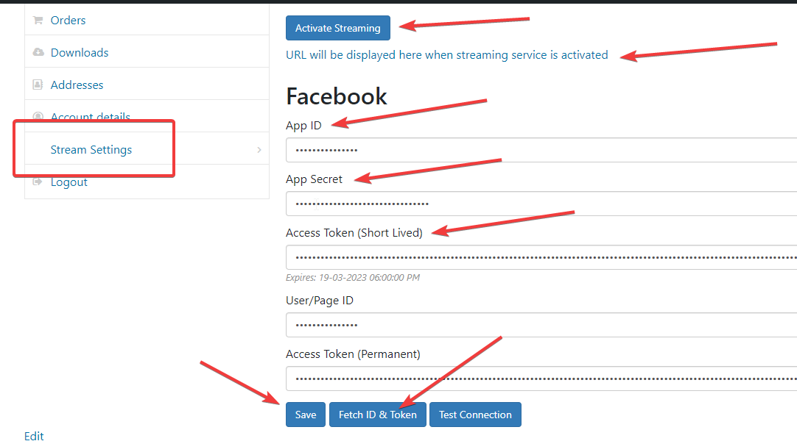

Now on the website, you’ll need to enter your Facebook app ID, app secret, and short-lived access token. Here’s how to do it:

1. Log in to your WordPress site and go to the `My Account` page.
2. Click on the `Stream Settings` page.
3. Enter your app ID, app secret, and short-lived access token.
4. Click on `Fetch ID & Token` button.
5. Click `Save` button when ID and permanent token are fetched.
6. Click `Activate Streaming` button at the top of the settings page. You’ll receive your channel link once your request is approved by the admin.

    

 
