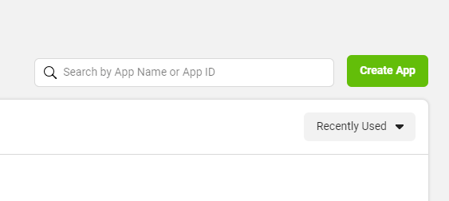
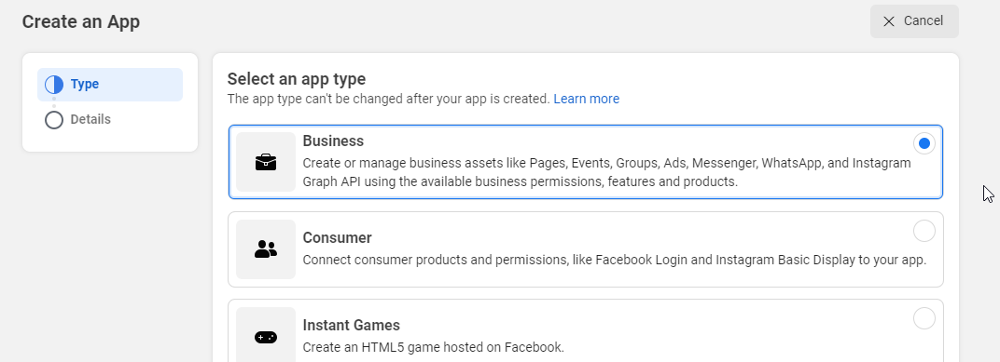
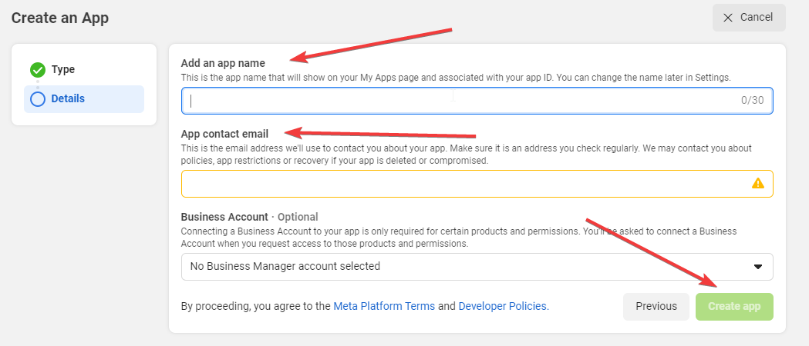
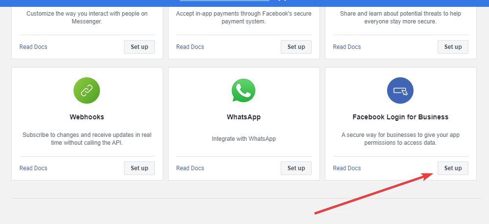
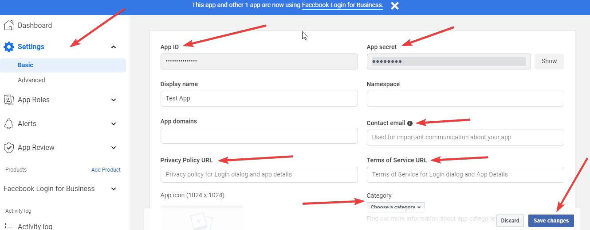

1. You must have a Facebook page.
2. Go to [https://developers.facebook.com/apps/](https://developers.facebook.com/apps/){target=_blank} and click on `Create App`.

    

3. Select `Business` and click the `Next` button at the bottom.

    

4. Add an `App Name` and `Contact Email` and click `Create App`.
5. Enter your password and click `Submit` if prompted.

    

6. Your app will be created in a moment, and you’ll be redirected to it.
7. Scroll down and click on `Set Up` under Facebook Login for Business.
8. It will be added, and you’ll be redirected to its settings. Click `Save` without any changes.

    

9. Navigate to `Settings > Basic` from the left side.
10. Copy the `App ID` and `App Secret`.
11. Add your `Contact Email`, `Privacy Policy URL`,` Terms of Service URL`, select a `Category`, and click `Save Changes` button.

    

 
