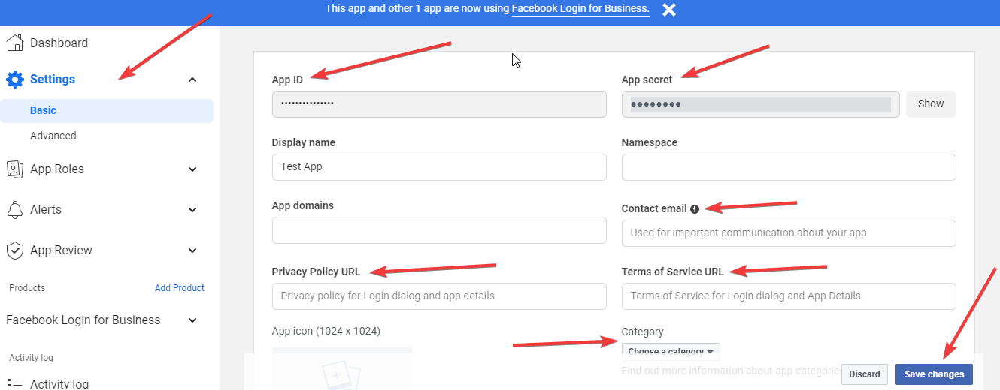

To generate a short-lived access token for your Facebook app, follow these steps:

1. Go to [https://developers.facebook.com/tools/explorer/](https://developers.facebook.com/tools/explorer/){target=_blank}
2. Select your `Meta App Name`.
3. Select either `User or Page`.
4. Select these two permissions: `pages_show_list` and `pages_read_engagement`.
5. Click on `Submit` to test the access token, then copy it.

    

 
